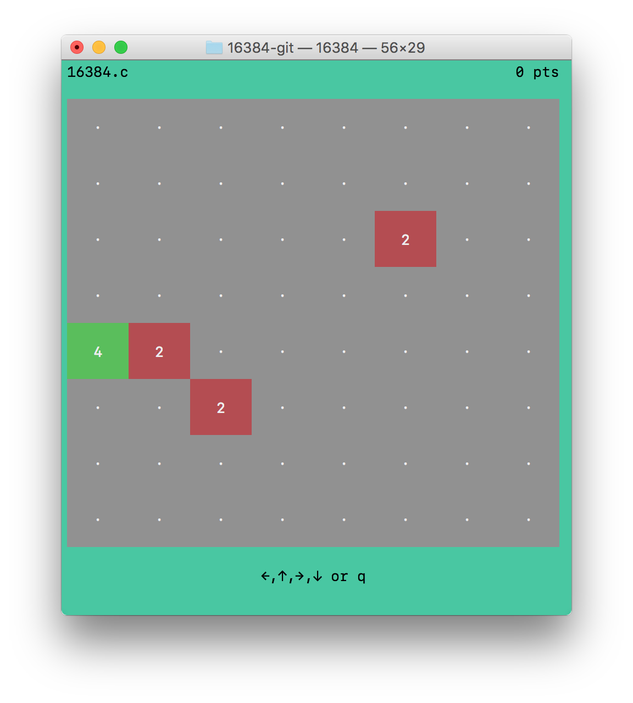

# 16384.c [](https://travis-ci.org/EtherTyper/16384.c)



Console version of the game ["16384"](aNNIMON.github.io/16384/) for GNU/Linux and macOS

### Gameplay

You can move the tiles in four directions using the arrow keys: up, down, left, and right. All numbers on the board will slide into that direction until they hit the wall and if they bump into each other then two numbers will be combined into one if they have the same value. Each number will only be combined once per move. Every move a new number 2 or 4 appears. If you have a 16384 on the board you have won, but you lose once the board is full and you cannot make a move. 

### Requirements

- C compiler
- GNU/Linux or macOS

### Installation

```
git clone https://github.com/ethertyper/16384.c.git 16384
cd 16384
make
./16384
```

### Running

The game supports different color schemes. This depends on ANSI support for 88 or 256 colors. If there are not enough colors supported the game will fallback to black and white (still very much playable). For the original color scheme run:

```
./16384
```
For the black-to-white color scheme (requires 256 colors):

```
./16384 blackwhite
```

For the blue-to-red color scheme (requires 256 colors):

```
./16384 bluered
```

### Contributing

Contributions are very welcome. Always run the tests before committing using:

```
$ ./1684 test
All 13 tests executed successfully
```

### Patchfile and differences from `2048.c`

```bash
git format-patch 578a5f314e1ce31b57e645a8c0a2c9d9d5539cde --stdout -- 16384.c 2048.c
```

```diff
From 071f5a1a3e533ddb98e42d06e821a793c9327a3a Mon Sep 17 00:00:00 2001
From: ELI JOSEPH BRADLEY <EtherTyper@users.noreply.github.com>
Date: Thu, 29 Dec 2016 09:25:15 -0600
Subject: [PATCH 1/7] Update and rename 2048.c to 16384.c

---
 2048.c => 16384.c | 4 ++--
 1 file changed, 2 insertions(+), 2 deletions(-)
 rename 2048.c => 16384.c (99%)

diff --git a/2048.c b/16384.c
similarity index 99%
rename from 2048.c
rename to 16384.c
index 5ffd2e1..fbc002f 100644
--- a/2048.c
+++ b/16384.c
@@ -17,7 +17,7 @@
 #include <time.h>
 #include <signal.h>
 
-#define SIZE 4
+#define SIZE 8
 uint32_t score=0;
 uint8_t scheme=0;
 
@@ -43,7 +43,7 @@ void drawBoard(uint8_t board[SIZE][SIZE]) {
 	char color[40], reset[] = "\033[m";
 	printf("\033[H");
 
-	printf("2048.c %17d pts\n\n",score);
+	printf("16384.c %17d pts\n\n",score);
 
 	for (y=0;y<SIZE;y++) {
 		for (x=0;x<SIZE;x++) {
-- 
2.11.0


From ae00aab1cae10ca96f75720f95b66b9900ebc839 Mon Sep 17 00:00:00 2001
From: ELI JOSEPH BRADLEY <EtherTyper@users.noreply.github.com>
Date: Thu, 29 Dec 2016 09:28:10 -0600
Subject: [PATCH 2/7] Attribute myself and original developers

---
 16384.c | 6 +++++-
 1 file changed, 5 insertions(+), 1 deletion(-)

diff --git a/16384.c b/16384.c
index fbc002f..fca6ed4 100644
--- a/16384.c
+++ b/16384.c
@@ -1,8 +1,12 @@
 /*
  ============================================================================
+ Name        : 16384.c
+ Author      : Eli Joseph Bradley
+ Description : Console version of the game "16384" (https://github.com/aNNiMON/16384) for GNU/Linux
+ ============================================================================
  Name        : 2048.c
  Author      : Maurits van der Schee
- Description : Console version of the game "2048" for GNU/Linux
+ Description : Console version of the game "2048" (https://github.com/gabrielecirulli/2048) for GNU/Linux
  ============================================================================
  */
 
-- 
2.11.0


From 2a8a1b290e33e1c0670d1798cd1c977c7d769e23 Mon Sep 17 00:00:00 2001
From: ELI JOSEPH BRADLEY <EtherTyper@users.noreply.github.com>
Date: Thu, 29 Dec 2016 10:05:04 -0600
Subject: [PATCH 3/7] Update 16384.c with proper formatting.

---
 16384.c | 10 +++++-----
 1 file changed, 5 insertions(+), 5 deletions(-)

diff --git a/16384.c b/16384.c
index fca6ed4..1dd62a2 100644
--- a/16384.c
+++ b/16384.c
@@ -47,7 +47,7 @@ void drawBoard(uint8_t board[SIZE][SIZE]) {
 	char color[40], reset[] = "\033[m";
 	printf("\033[H");
 
-	printf("16384.c %17d pts\n\n",score);
+	printf("16384.c %44d pts\n\n",score);
 
 	for (y=0;y<SIZE;y++) {
 		for (x=0;x<SIZE;x++) {
@@ -80,7 +80,7 @@ void drawBoard(uint8_t board[SIZE][SIZE]) {
 		printf("\n");
 	}
 	printf("\n");
-	printf("        ←,↑,→,↓ or q        \n");
+	printf("                      ←,↑,→,↓ or q                      \n");
 	printf("\033[A"); // one line up
 }
 
@@ -410,12 +410,12 @@ int main(int argc, char *argv[]) {
 			addRandom(board);
 			drawBoard(board);
 			if (gameEnded(board)) {
-				printf("         GAME OVER          \n");
+				printf("                       GAME OVER                        \n");
 				break;
 			}
 		}
 		if (c=='q') {
-			printf("        QUIT? (y/n)         \n");
+			printf("                      QUIT? (y/n)                       \n");
 			c=getchar();
 			if (c=='y') {
 				break;
@@ -423,7 +423,7 @@ int main(int argc, char *argv[]) {
 			drawBoard(board);
 		}
 		if (c=='r') {
-			printf("       RESTART? (y/n)       \n");
+			printf("                     RESTART? (y/n)                     \n");
 			c=getchar();
 			if (c=='y') {
 				initBoard(board);
-- 
2.11.0


From 3acc4540e5369f178e078b71e10ef0538fd21aa4 Mon Sep 17 00:00:00 2001
From: ELI JOSEPH BRADLEY <EtherTyper@users.noreply.github.com>
Date: Thu, 29 Dec 2016 16:55:09 -0600
Subject: [PATCH 4/7] Pre-populate the board with 4 enemies

---
 16384.c | 4 ++--
 1 file changed, 2 insertions(+), 2 deletions(-)

diff --git a/16384.c b/16384.c
index 1dd62a2..1df3bd6 100644
--- a/16384.c
+++ b/16384.c
@@ -262,8 +262,8 @@ void initBoard(uint8_t board[SIZE][SIZE]) {
 			board[x][y]=0;
 		}
 	}
-	addRandom(board);
-	addRandom(board);
+	for (int i=0; i<4; i++)
+		addRandom(board);
 	drawBoard(board);
 	score = 0;
 }
-- 
2.11.0


From 3a4502a717b6297c11f1d298f4683e3e9c21a90f Mon Sep 17 00:00:00 2001
From: ELI JOSEPH BRADLEY <EtherTyper@users.noreply.github.com>
Date: Thu, 29 Dec 2016 17:27:40 -0600
Subject: [PATCH 5/7] Add potential to multiply tile by 4 on merge.

See https://github.com/aNNiMON/16384/blob/2d2f07e2180dfeb01f4ef893c5b84f436ec54809/js/game_manager.js#L130-L131
---
 16384.c | 4 ++++
 1 file changed, 4 insertions(+)

diff --git a/16384.c b/16384.c
index 1df3bd6..97d6ad7 100644
--- a/16384.c
+++ b/16384.c
@@ -123,6 +123,10 @@ bool slideArray(uint8_t array[SIZE]) {
 				} else if (array[t]==array[x]) {
 					// merge (increase power of two)
 					array[t]++;
+
+					int multiply = rand() % 500;
+					if (multiply > 493) array[t]++;
+
 					// increase score
 					score+=(uint32_t)1<<array[t];
 					// set stop to avoid double merge
-- 
2.11.0


From 475642ce007f715fd6dd10b5dc0530f7ac7777b7 Mon Sep 17 00:00:00 2001
From: ELI JOSEPH BRADLEY <EtherTyper@users.noreply.github.com>
Date: Thu, 29 Dec 2016 19:34:16 -0600
Subject: [PATCH 6/7] Fix test suite

---
 16384.c | 26 +++++++++++++-------------
 1 file changed, 13 insertions(+), 13 deletions(-)

diff --git a/16384.c b/16384.c
index 97d6ad7..b60943c 100644
--- a/16384.c
+++ b/16384.c
@@ -300,19 +300,19 @@ int test() {
 	uint8_t array[SIZE];
 	// these are exponents with base 2 (1=2 2=4 3=8)
 	uint8_t data[] = {
-		0,0,0,1,	1,0,0,0,
-		0,0,1,1,	2,0,0,0,
-		0,1,0,1,	2,0,0,0,
-		1,0,0,1,	2,0,0,0,
-		1,0,1,0,	2,0,0,0,
-		1,1,1,0,	2,1,0,0,
-		1,0,1,1,	2,1,0,0,
-		1,1,0,1,	2,1,0,0,
-		1,1,1,1,	2,2,0,0,
-		2,2,1,1,	3,2,0,0,
-		1,1,2,2,	2,3,0,0,
-		3,0,1,1,	3,2,0,0,
-		2,0,1,1,	2,2,0,0
+		0,0,0,1,1,0,0,0,	2,0,0,0,0,0,0,0,
+		0,0,1,1,2,0,0,0,	2,2,0,0,0,0,0,0,
+		0,1,0,1,2,0,0,0,	2,2,0,0,0,0,0,0,
+		1,0,0,1,2,0,0,0,	2,2,0,0,0,0,0,0,
+		1,0,1,0,2,0,0,0,	2,2,0,0,0,0,0,0,
+		1,1,1,0,2,1,0,0,	2,1,2,1,0,0,0,0,
+		1,0,1,1,2,1,0,0,	2,1,2,1,0,0,0,0,
+		1,1,0,1,2,1,0,0,	2,1,2,1,0,0,0,0,
+		1,1,1,1,2,2,0,0,	2,2,3,0,0,0,0,0,
+		2,2,1,1,3,2,0,0,	3,2,3,2,0,0,0,0,
+		1,1,2,2,2,3,0,0,	2,3,2,3,0,0,0,0,
+		3,0,1,1,3,2,0,0,	3,2,3,2,0,0,0,0,
+		2,0,1,1,2,2,0,0,	2,2,4,0,0,0,0,0
 	};
 	uint8_t *in,*out;
 	uint8_t t,tests;
-- 
2.11.0


From 877ff071aa5e166b8bdd9b0600d6fc0b66f1d123 Mon Sep 17 00:00:00 2001
From: ELI JOSEPH BRADLEY <EtherTyper@users.noreply.github.com>
Date: Thu, 29 Dec 2016 19:35:47 -0600
Subject: [PATCH 7/7] Fix typo in tests.

---
 16384.c | 2 +-
 1 file changed, 1 insertion(+), 1 deletion(-)

diff --git a/16384.c b/16384.c
index b60943c..ffabd7b 100644
--- a/16384.c
+++ b/16384.c
@@ -312,7 +312,7 @@ int test() {
 		2,2,1,1,3,2,0,0,	3,2,3,2,0,0,0,0,
 		1,1,2,2,2,3,0,0,	2,3,2,3,0,0,0,0,
 		3,0,1,1,3,2,0,0,	3,2,3,2,0,0,0,0,
-		2,0,1,1,2,2,0,0,	2,2,4,0,0,0,0,0
+		2,0,1,1,2,2,0,0,	2,2,3,0,0,0,0,0
 	};
 	uint8_t *in,*out;
 	uint8_t t,tests;
-- 
2.11.0
```
